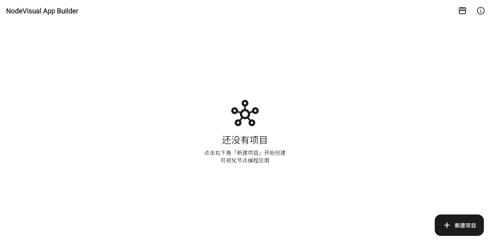
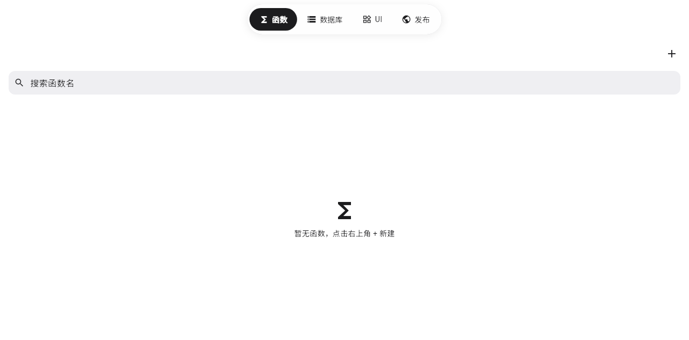

# NodeVisual App Builder

跨端可视化节点编程工具。通过拖拽组件与连接节点快速构建应用，并一键编译为 Web / Android / Windows 多端产物。

[在线体验](https://happy-everyday-everyweek.github.io/nodevisual-app-builder/)



## 核心特性

- **可视化节点编程**：两步点击连线构建函数逻辑，控制流与数据流解耦。
- **可视化 UI 编辑器**：拖拽组件生成界面，属性绑定到函数输出。
- **多端编译打包**：端侧完成构建，输出 Web（HTML/JS）、Android（.nvapk）、Windows（.nvexe）。
- **变量与插件系统**：统一的 `#` 引用表达多源数据；内置 OpenAI / Anthropic 插件，支持从插件市场安装 HTTP 插件。



## 快速开始

```bash
flutter pub get
flutter run
```

构建 Web：

```bash
flutter build web
```

## 平台支持

| 平台 | 状态 |
|------|------|
| Web   | 支持 |
| Android | 支持 |
| Windows | 支持 |

UI 组件在所有平台行为一致；部分原生能力节点（如震动、分享）仅在特定平台可用。详见 [docs/architecture.md](./docs/architecture.md)。

## 技术栈

Flutter · Dart · Riverpod · GoRouter · SQLite

## 许可证

[MIT](./LICENSE)
